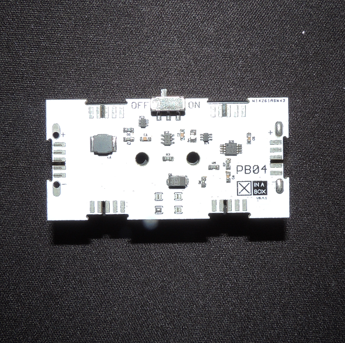

# PB04 

Library for PB04: Smart Battery Module

This module can be purchased on [Xinabox CC](https://xinabox.cc/modules/power/PB04/).

## About the SW01
The PB04 makes use of the INA199A2DCKR current sensor and Max11647 Analog to Digital Converter. These two low-cost precision sensors allow user to accurately measure power useage, instantaneous usage and total power used over the period.

More information regarding these sensors can in thier respective datasheets:

INA199A2DCKR [datasheet](http://www.ti.com/lit/ds/symlink/ina199.pdf)

Max11647 [datasheet](https://datasheets.maximintegrated.com/en/ds/MAX11646-MAX11647.pdf)

## Requirements
*TODO
